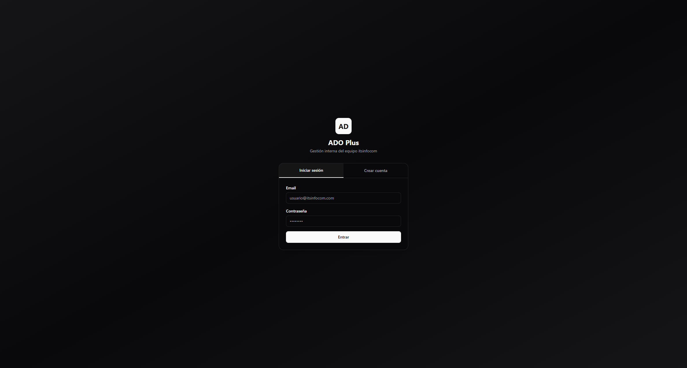
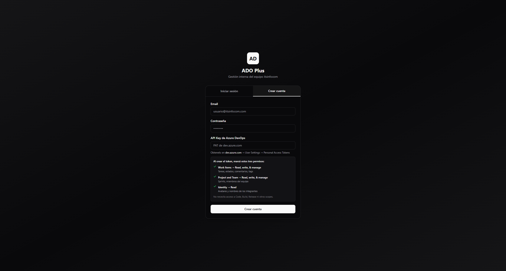
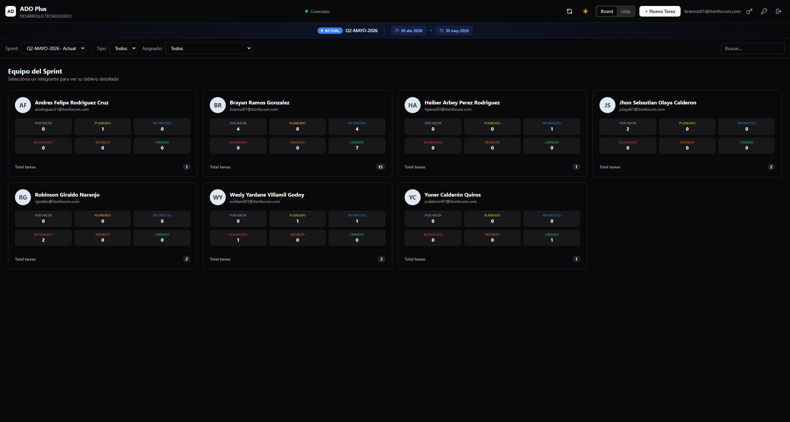

# ADO Plus

Aplicación web interna que reemplaza la UI de Azure DevOps con una interfaz más clara y eficiente, similar a Jira o ClickUp.



## 🚀 Inicio rápido

### Prerrequisitos
- Node.js 18+
- pnpm 8+
- Una cuenta en Azure DevOps con acceso al proyecto

### Instalación

1. Clona el repositorio:
```bash
git clone https://github.com/brayanramos958/ado-plus.git
cd ado-plus
```

2. Instala dependencias:
```bash
pnpm install
```

3. Configura el archivo de entorno:
```bash
cp .env.example backend/.env
```

4. Inicia la aplicación:
```bash
pnpm dev
```

5. Abre el navegador en **http://localhost:5173** y veraz la pantalla de login.

## 🔑 Configuración del PAT (Primer uso)

La primera vez que uses la app, necesitas configurar tu Personal Access Token de Azure DevOps:

### Paso 1: Crear una cuenta

Si no tienes cuenta, haz clic en la pestaña **"Registrarse"** e ingresa:
- Email
- Contraseña


### Paso 2: Ingresar tu PAT

Después de registrarte, el sistema te pedirá tu **Personal Access Token (PAT)** de Azure DevOps.

Para obtenerlo:
1. Ve a **https://dev.azure.com/itsinfocom** → Click en tu avatar → **Personal access tokens**
2. Click en **+ New Token**
3. Configura:
   - **Name**: "ADO Plus" o cualquier nombre descriptivo
   - **Expiration**: 30 días (o el que prefieras)
   - **Scopes**: **Work Items** (Read & write) y **Project & Team** (Read)
4. Copy el token generado y pégalo en el campo de la app



### Paso 3: Listo

Después de guardar el PAT, verás el board principal con los sprints y tareas del equipo.



## ✅ Funcionalidades

- **Sistema de autenticación multi-usuario**: Registro, login, y gestión de PAT por usuario
- **Board de equipo**: Vista swimlane con todos los miembros del equipo y sus tareas
- **Vista detallada por usuario**: Filtra y ve las tareas asignadas a cada miembro
- **Gestión de sprints**: Selector de sprint con sprints disponibles en ADO
- **Detalle de work items**: Panel lateral con información completa, comentarios y edición rápida
- **Drag & drop**: Mueve tareas entre estados directamente
- **Sistema de horas**: Registro de horas al cambiar estado (En proceso → Resuelto/Cerrado)

## 🏗️ Arquitectura

```
Browser (:5173 React)
  ↓ fetch /api/*
Vite proxy transparente
  ↓ redirige a
Express backend (:3001)
  ↓ + Authorization: Basic <PAT>
Azure DevOps REST API v7.0
```

- El PAT nunca llega al browser - el backend lo inyecta en todas las requests
- Cada usuario tiene su propio PAT encriptado en la base de datos SQLite
- El PAT global de `.env` sirve como fallback

## 📁 Estructura del proyecto

```
ado-plus/
├── backend/                  # Express proxy hacia ADO API
│   └── src/
│       ├── auth/             # Middleware JWT, rate limiter, validators
│       ├── routes/           # Rutas API (auth, workitems, iterations, members)
│       ├── config.ts         # Configuración y secrets
│       ├── db.ts            # SQLite con mejor-sqlite3
│       ├── index.ts         # Entry point
│       └── proxy.ts         # Proxy handler hacia ADO
├── frontend/                 # React app
│   └── src/
│       ├── api/             # Cliente API y queries TanStack
│       ├── components/      # Componentes UI
│       ├── context/         # AuthContext
│       ├── hooks/          # Custom hooks (useWorkItems, etc.)
│       ├── pages/          # Pages (LoginPage, SprintPage)
│       └── stores/         # Zustand stores
├── docs/                     # Documentación y screenshots
│   └── screenshots/
├── pnpm-workspace.yaml      # Configuración monorepo
└── package.json            # Scripts compartidos
```

## 🛠️ Comandos

```bash
# Desarrollo - levanta todo (backend + frontend)
pnpm dev

# Solo backend
pnpm --filter ./backend dev

# Solo frontend
pnpm --filter ./frontend dev

# Producción
pnpm --filter ./backend build   # Compila backend
pnpm --filter ./frontend build  # Compila frontend
```

## 🔧 Configuración

### Variables de entorno (backend/.env)

```bash
PAT_TOKEN=<tu_personal_access_token>
ADO_ORG=itsinfocom
ADO_PROJECT=DESARROLLO%20TECNOLOGICO
ADO_PROJECT_NAME=DESARROLLO TECNOLOGICO
ADO_TEAM=DESARROLLO%20TECNOLOGICO%20Team
ADO_TEAM_ID=3d8bbe19-d49c-41c4-9fc1-dc810bdef2d3
PORT=3001
```

> **Nota**: Al iniciar por primera vez, el backend genera automáticamente `JWT_SECRET` y `ENCRYPTION_KEY`. Solo `PAT_TOKEN` es obligatorio.

### Equipo Azure DevOps
- **Organización**: `itsinfocom`
- **Proyecto**: `DESARROLLO TECNOLOGICO`
- **Team**: `DESARROLLO TECNOLOGICO Team`

## 📊 Stack técnico

- **Monorepo**: pnpm workspaces
- **Frontend**: React 19 + Vite + TypeScript
- **Estado**: Zustand (UI) + TanStack Query (servidor)
- **UI**: Base UI + Tailwind CSS v4
- **Backend**: Express.js (proxy hacia ADO API)
- **Base de datos**: SQLite (autenticación)
- **Seguridad**: JWT, AES-256-CBC para PAT encriptado

## 🐛 Solución de problemas

### Error 401 Unauthorized
- Verifica que el PAT_TOKEN en `backend/.env` sea válido
- Asegúrate de que el token tenga permisos de Work Items y Project & Team
- El token podría haber expirado (renuévalo en Azure DevOps)

### Error 401 después de login (PAT expirado)
- El usuario debe actualizar su PAT desde la interfaz (Header → Actualizar PAT)
- El sistema detecta cuando el PAT expira y requiere uno nuevo

### Puerto ocupado
- Si el puerto 3001 está ocupado: mata el proceso o cambia PORT en `.env`
- Si el puerto 5173 está ocupado: Vite usará el siguiente disponible automáticamente

### En Windows: proceso Node zombie
```bash
taskkill /F /IM node.exe
```

## 📝 Notas

- El backend es un proxy delgado que inyecta autenticación
- Azure DevOps es la fuente de verdad - no hay base de datos propia para work items
- Multi-asignación se implementa vía tags con prefijo `assignee:`